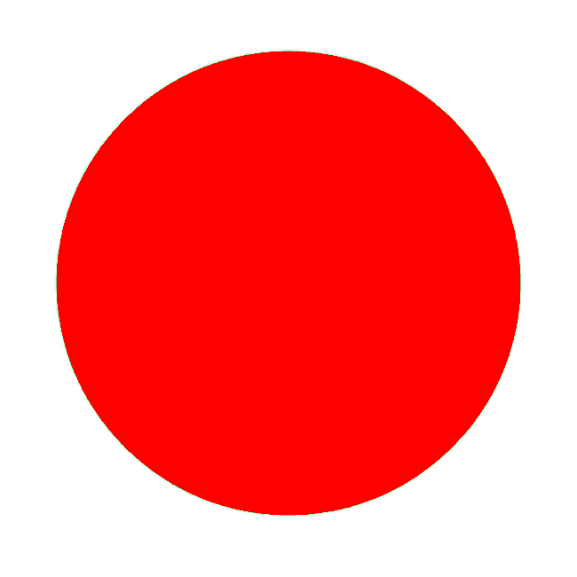

# ascii-art

## Description
This Project will take an image and print out an [ASCII-art](https://en.wikipedia.org/wiki/ASCII_art).

## About this Project
This project uses [opencv](https://www.opencv.org) to process image and [numpy](https://numpy.org) to manipulate arrays. The Image is numerically coded for different threshold regions it comes under and for each coded regions , a symbol is used for printing it out in the stdout.

## Sample
Input Image :

Output :

Developed by **Md Shahria Alam**

Happy coding🧨🧨